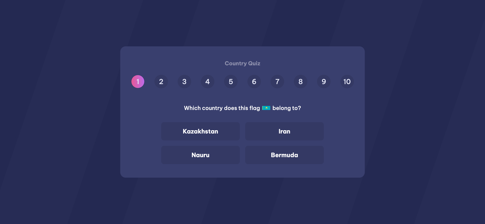

# [Frontend Country Quiz]

This is a simple quiz app to test your knowledge about countries.

## Table of Contents

- [Introduction](#introduction)
- [Screenshot](#screenshot)
- [Live Demo](#live-demo)
- [Features](#features)
- [Technologies](#technologies)
- [Getting Started](#getting-started)
- [Author](#author)

## Introduction

This is a pure frontend project that uses the REST Countries API to fetch the data about the countries. The user will be asked two type of questions: what country a city is the capital of and which country belongs a flag. The user will be able to see the score at the end of the quiz.

This game is a project from the dev-challenges website. You can see the challenge page [here](https://devchallenges.io/challenge/country-quizz)

## Screenshot


## Live Demo

- [Check it out here](https://stunning-donut-b843fc.netlify.app/)

## Features

- Fetch data from the REST Countries API
- Two types of questions: capital of a city and flag of a country
- Score at the end of the quiz
- Responsive design
- Start again with new questions

## Technologies

- HTML
- SCSS (Sass) for styling
 - SolidJS (JavaScript library)
- TypeScript (JavaScript superset)
- Vite (bundler)
- REST Countries API
- Netlify (deployment)

## Getting Started

- Clone this repository
- Install node.js if you don't have it
- Install pnpm if you don't have it
- Go to the project directory in your terminal

- Run this command to install dependencies:

```bash
    pnpm install
```

- Run this command to run the project locally:

```bash
    pnpm run dev
```

This will launch the project in localhost

- Run this command to build the project

```bash
    pnpm run build
```

## Author

- [LinkedIn](www.linkedin.com/in/roberto-ramirez-aguilar)
- [Github](https://github.com/Robertron624)
- [Webpage](https://robert-ramirez.co/)

